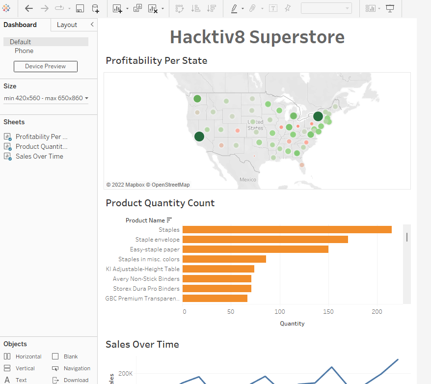

# Tableau Dashboard

## Dataset Introduction

The data set we will be using in this tutorial is Superstore Sample from Tableu Public Dataset. You can download from [here](https://github.com/ardhiraka/PFDS_sources/raw/master/sample_-_superstore.xls).

After you load the data, on the left hand side of the page you can see that there are three different datasets, **Orders**, **People** and **Returns**. To view a dataset, you simply drag and drop a dataset from the left into the top middle of the screen that says *Drag sheets here*. The first dataset we will look at is the Orders table.

You can then preview the dataset where we can see information on individual orders. The dataset columns include **Customer Name, City, Product Name, Sales and Profit.**

Now that we have previewed our data, we can begin our analysis by pressing **Sheet 1** on the **bottom left** of the page which will open up a worksheet that looks like the image below.

## Visualizing the Data

### Visualizing the Profit

On the left hand side of the page we can see all of the columns from the **Order** dataset.

To get an idea of how our data can be visualized we will start by simply clicking on the **State** field under the **Dimensions** header and **drag it to the center of the sheet** that says Drop field here.

We now see the States that are included in our Orders table and that they are marked by a blue dot. If it is marked in blue that means there has been at least one order from that state.

Right now all the blue dots are the same size. What if we want to see which states make the most profitable orders?

To do this click on **Profit** underneath the Measures header and **drag it to the center** of the worksheet.

We can now see that the different dots are different sizes and correspond to how profitable each state is. We can quickly gain some insights just by glancing at this visualization like, New York and California and very profitable and Texas and Ohio are not.

This type of visualization could be helpful for a company deciding where they should focus their marketing efforts. If you hover your mouse over any state, you can also see what the profit was in that particular state.

Right now we can only see that some states are making more profit than others and some are making less of a profit. What if we wanted to easily see which States were bringing in a profit and which States were losing money?

We can do this by adding colors to our visualization.

To do this, again select **Profit** from under the Measures header on the left hand side of the page and drag it over the icon that says **Color** in the **Marks box**. Now the dots on the map are different colors.

You can change these colors by clicking on the Color icon again and select **Edit Colors…**. There you will see a drop down for different Palette options. For this tutorial We chose Red-Green Diverging and selected the box that says Use Full Color Range but feel free to chose whatever color palette you prefer.

Now we can see that the greener and larger a dot is over a state, the more profitable that state is. We can also see that the redder and smaller a dot is over a state, the more money that state is losing. I chose the Red-Green Diverging color palette as it makes it very easy for someone else to come in and understand the data. If a dot is red over a state they are losing money, if a dot is green over a state they are making a profit.

Before we make another data visualization make sure to rename this worksheet by selecting the button on the bottom left of the page that says **Sheet 1** and rename it to **Profitability per State**.

### Visualizing the Popularity

We can create a new worksheet, by selecting the tab to the right of the newly named **Profitability per State** tab on the bottom left hand side of the screen.

Now we will make a visualization that will show us which products are the most popular. To do this we are going to select **Product Name** and drag it into the middle of our sheet like we did before with out last worksheet.

Next to each product name we see there is another column and every value of that column says **Abc**.

To view the quantity each item was ordered we will **drag Quantity** from under the Measures header **right to the column** that contains **Abc** for every value.

We can now see the order quantity for each product right next to the products name.

There are a lot of products and it is a long list to go through. To make it easier to see which products are selling the most and which are selling the least we can sort our data by showing the products with the highest order quantity at the top of our list and products with the lowest order quantity at the bottom of our list.

To do this, hover your mouse over the sheet where it says **Product Name**. A drop down option should come up that allows you to sort the data by either Alphabetic or SUM(Quantity). Select **SUM(QUANTITY)**.

Now we can easily see which items are bought the most and which are bought the least.

We have a nice list but now we want to visualize this data. To do that select on the **horizontal bar graph** on the left hand side of the page. Go ahead and change the color of the graph just as we did before as well as the sheet name from **Sheet 2** to something like **Product Quantity Count**.

### Visualizing the Sales

We’ll make one last data visualization before we make our dashboard.

Create a new worksheet just by clicking on the new worksheet icon at the bottom of the page.

This time we will look at sales over time. To do this we’re going to select **Order Date** from under the **Dimensions** header and drag it to the center of our worksheet.

Next select **Sales** and drop it in the column next to **Order Date**. This should be an empty column where **Abc** is listed as every value of that column.

We can now see the amount of sales this company produced every year since 2016.

This is nice but what if we want to see the sales of every quarter.

To do this select **YEAR(Order Date)** where it is listed in **Rows**. A drop down option will come up that will allow you to break the data up in Years, Quarters, Months and Days, select on **Quarter**. Quarter list will appear twice in this drop down, **select the second Quarter** you see in that list.

We can now see the sales for every quarter but it is not visually appealing.

To easily view sales we’ll try using the **lines(continuous)** graph option on the left.

Now it is easy to see how Sales have changed over time. We can also see a pattern of highs and peaks. This is much easier to see through this line graph than through the list of numbers we saw before.

We can now rename this worksheet to **Sales Over Time** and get started with our dashboard.

## Making Dashboard

To create a new dashboard you can select the icon on the bottom left of a screen that looks like a window with a **+** over it. If you hover your mouse over the icon it should say **New Dashboard**. You should be brought to the page shown below.

On the left hand side we can see the names of our worksheets we created. Start by clicking and dragging **Profitability Per State** from the left to the center of the screen where it says **Drop sheets here**.

Drag over the other two worksheets. You can resize each image as you wish. Your dashboard may look something like this after you resize your visualizations.

You can also remove the legends next to the top map visualization by simply clicking on each legend and then pressing the **X** in the top right corner.

Next we are going to filter our entire dashboard by state. To do this, click on the top of the map visual and press the third button down on the right hand side, it should say **Filter** when you hold your mouse above it.

Now, when you click on a state on the top map, each of the two visualizations below will show data from just that state.

Below, I had selected on California, you can see below that the top products that were sold have changed, it is only showing the Product Quantity Count from California.

The bottom graph also only shows Sales Over Time information from California. This feature allows us to make the dashboard more interactive. If you click the map again you will go back to the default dashboard, where data from all States is included.

Now we will add a title by clicking on **Text** under Objects on the left hand side of the page.

Drag and drop **Text** to the top of the page or where ever you prefer to have the title for the dashboard. You will have to resize the text box so your graphs are still easily visible.

After giving your dashboard a title, make sure to rename the tab from **Dashboard 1** to something like **Superstore Dashboard**.

This is a very simple dashboard and I encourage you to play around a bit with all the features. For this tutorial we will simply leave the dashboard as is and move on to publishing the dashboard.

Now you can go to the top left of your computer where it says **File** and select **Save to Tableau Public As…**

You will then be asked to sign into the Tableau Public account you had created. Once you sign in, it will ask you to provide a name to save the dashboard under. Once you have done that a webpage will pop up with your dashboard on your Tableau Public profile.

You have now created your first Tableau Public dashboard! You can share your dashboard with others by embedding it into your website or sending a sharable link.

